The Request Kit provides the recommended path for preparing a structured SpQE request.

SpQE means **Specification-to-Prototype Qualification Engine** and is pronounced **Speky**.

Users should first read a minimal but complete Prototype SpecBlock example, then read the best practices for building a SpecBlock. These two documents help turn a vague prototype idea into a concrete, structured, and testable request.

The user then completes two documents: the **SpQE Prototype Request Form** and the **SpQE Contact Dossier Form**. Both forms should be sent through the SpQE contact or intake channel at `contact@spqe.yahoo.fr`.

During the current non-commercial showcase phase, SpQE may offer one prototype generation-and-test run free of charge per company or legal entity, subject to review, feasibility, and intake capacity.

After review by SpQE, the prototype may be generated and tested.

When a prototype run is delivered, two versions may be returned:

* the raw generated version, preserving the first generation result;
* the corrected version, after qualification checks, repairs, and validation steps.

Additional artifacts may also be returned when available, such as test outputs, qualification notes, reproducibility notes, and user-facing documentation.

This separation makes the generation process more transparent. It allows the user to compare the initial prototype with the corrected prototype and to understand what was improved during the qualification phase.

